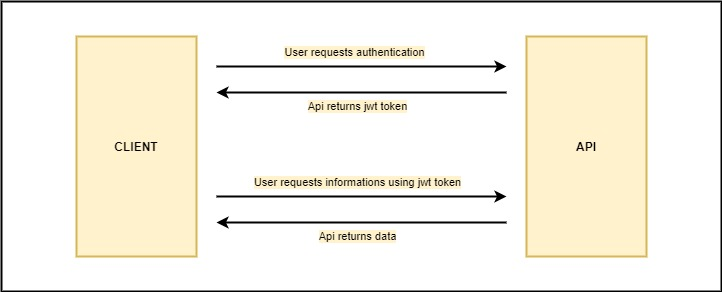

# CatholicChurch

Simple RESTful nodejs API  using: body-parser, cls-hooked, cors, dotenv, express, express-rate-limit, express-slow-down, faker-br, helmet, mysql2, nodemon, sequelize.

# Instalation

```
npm install --save
```

## Migration using Sequelize

```
npx sequelize-cli init
npx sequelize-cli model:generate --name Saints --attributes name:string, date:DATEONLY, resume:string, active:boolean
npx sequelize-cli model:generate --name Users --attributes username:string,password:string,active:boolean
npx sequelize-cli db:migrate
```

## Seeds 

```
npx sequelize-cli seed:generate --name demo-users
npx sequelize-cli seed:generate --name demo-saints
npx sequelize-cli db:seed:all
```

## Requisites

- Mysql installed 
- Configurated file config/config.js

## Executing api

```
nodemon .\index.js 
```

# Api flow

- Authenticate: http://localhost:3000/api/authenticate 
- Login: http://localhost:3000/api/login 
- Login: http://localhost:3000/api/logout

- Get all saints: http://localhost:3000/api/saints
- Get one saint: http://localhost:3000/api/saints/{id}
- Insert/Update saint: http://localhost:3000/api/saints
- Delete saint: http://localhost:3000/api/saints/{id}

- Authenticate route: get valid jwt token
- Others routes: send jwt token into header x-access-token


